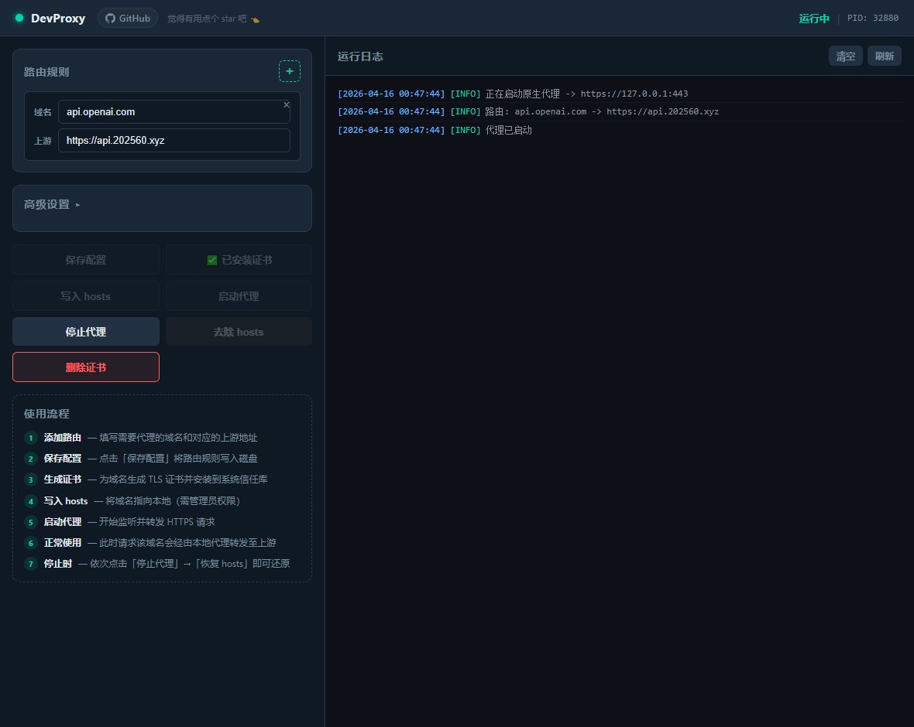
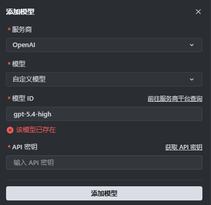
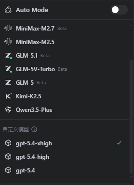

# DevProxy

<p align="center">
  <a href="https://github.com/Qhaozhan/DevProxy/releases"></a>
  
  
  
  
</p>

---

> **中文** | [English](#english)

---

## 项目简介

DevProxy 是一个面向 Windows 的本地 HTTPS 入口代理工具，核心目标很直接：

- 接住被 `hosts` 劫持到本机的目标域名流量
- 把请求透明转发到你指定的上游
- 尽量不要求用户手敲命令、到处找路径、理解过多技术细节

当前主打场景：

- Trae 这类固定走 OpenAI 兼容入口的客户端
- 把 `api.openai.com` 转到自己的 `sub2api`或其他 OpenAI 兼容后端
- 需要本地透明接管，而不是在每个客户端里重复改一遍配置

> 它是一个偏本地、偏实用的入口代理工具，不是大而全的 AI 网关平台。

---

## 当前界面

### 1. 桌面版主界面



### 2. Trae 添加自定义模型



### 3. Trae 模型列表



---

## 快速开始

1. 前往 [Releases](https://github.com/Qhaozhan/DevProxy/releases) 下载最新版本：

   | 文件 | 说明 |
   |---|---|
   | `DevProxy_x64-setup.exe` | 安装版（推荐，约 3.4 MB） |
   | `DevProxy.exe` | 免安装便携版（约 13 MB，双击直接运行） |

2. 运行后，按界面引导依次完成：

```
保存配置 → 生成证书 → 写入 hosts → 启动代理
```

3. 打开 Trae / 任意客户端，正常使用 `api.openai.com`，流量将自动走本地代理转发至你的上游。

**关于证书安装：**

点击「生成证书」时，程序会自动弹出 UAC 授权请求，允许后证书将自动安装到系统信任库，无需手动操作。

如果 UAC 被拒绝，或需要重新信任，可手动安装 CA 证书：

1. 打开以下路径找到 `ca.pem` 文件：
   ```
   %APPDATA%\com.devproxy.desktop\runtime\proxy-core\certs\ca.pem
   ```
2. 将扩展名改为 `.crt`，双击安装到「受信任的根证书颁发机构」

---

## 主要功能

| 功能 | 说明 |
|---|---|
| 启动状态检测 | 启动时自动检测证书 / hosts 是否已配置，已完成步骤自动置灰 |
| 操作流程引导 | 界面只高亮当前可操作步骤，降低误操作 |
| Rust 原生 HTTPS 代理 | 基于 Axum + Rustls，无需系统代理，透明拦截 |
| 证书管理 | 自动生成自签证书 + UAC 自动安装信任，一键删除 |
| Hosts 管理 | Rust 原生写入 / 去除 hosts，无需手动编辑 |
| 配置持久化 | 上游地址、域名规则、超时等配置本地保存 |
| 运行日志 | 实时查看代理转发记录 |
| 关闭自动停止 | 关闭窗口时自动停止代理，避免端口残留 |

---

## 适合的使用场景

### 场景 1：Trae 透明接管 OpenAI 入口

最典型的用法：

- Trae 里选 OpenAI 服务商
- 本地把 `api.openai.com` 指到本机
- DevProxy 接住请求，再转到你自己的上游（如 `sub2api` 或其他兼容接口）

### 场景 2：给不方便自定义 `base_url` 的客户端兜底

有些 IDE / 插件不支持自定义 `base_url`，或 provider 限制比较死，不想在每个客户端里重复改配置。本地入口代理往往比继续在客户端层面找 workaround 更稳。

### 场景 3：多入口域名的本地接管

方向不限制只代理一个域名，后续可以扩展：

- `api.openai.com`
- `api.deepseek.com`
- 其他固定入口域名

---

## 工作原理

```text
客户端 ──> 目标域名（hosts 指向本机）──> DevProxy 本地 HTTPS ──> 你的上游
```

具体示例：

```text
Trae ──> api.openai.com ──> 127.0.0.1:443 ──> DevProxy ──> https://你的上游/v1
```

**关于监听端口 `443`：**

它不是在监听"OpenAI 官方服务器的 443"，而是本地代理自己的 HTTPS 监听端口。因为客户端访问的仍然是 `https://api.openai.com`，域名已经被 hosts 指向本机，所以代理接住的正是原本会发给 `api.openai.com:443` 的流量。

通常不需要改这个端口。只有本机 `443` 已被 Nginx / IIS / Apache 占用时，才需要调整。

---

## 技术栈

| 层 | 技术 |
|---|---|
| 桌面框架 | Tauri v2 |
| 后端 / 代理引擎 | Rust · Axum · Rustls · rcgen |
| 前端 UI | Vanilla JS / HTML / CSS |
| 证书 | rcgen 生成自签证书，UAC 自动安装到系统信任库 |
| 打包 | NSIS Windows 安装包 |

---

## 目录结构

```text
DevProxy/
├── desktop/         # Tauri 桌面版（当前主线）
│   ├── src/         # 前端 HTML / JS / CSS
│   └── src-tauri/   # Rust 后端 + Tauri 配置
├── images/          # 文档截图
└── README.md
```

---

## 常见问题

**Q: 客户端报 SSL 证书错误？**
A: 点击生成证书时，程序会自动弹 UAC 安装证书到系统信任库。若 UAC 被拒绝，请手动安装 CA：将 `%APPDATA%\com.devproxy.desktop\runtime\proxy-core\certs\ca.pem` 改名为 `.crt` 后双击，安装到「受信任的根证书颁发机构」。

**Q: 端口 443 被占用？**
A: 先关闭占用 443 的程序（Nginx / IIS 等），或在高级配置中改用其他端口。

**Q: 代理日志没有任何输出？**
A: 检查 hosts 是否已写入（界面「写入 hosts」步骤应显示已完成），以及客户端是否真的在请求目标域名。

**Q: 关闭窗口后代理是否还在运行？**
A: 不会。关闭窗口时代理会自动停止，端口 443 随即释放。

---

<a name="english"></a>

---

## Project Overview

DevProxy is a local HTTPS entry proxy for Windows. It intercepts traffic to target domains redirected to localhost via `hosts`, and transparently forwards it to your upstream — without requiring users to touch the command line.

**Primary use case:** AI clients like Trae that hardcode `api.openai.com` as their endpoint. Instead of reconfiguring every client, you intercept at the entry point and route to your own backend (sub2api or any OpenAI-compatible API).

> A practical local entry proxy — not a full-featured AI gateway.

---

## Quick Start

1. Download the latest version from [Releases](https://github.com/Qhaozhan/DevProxy/releases):

   | File | Description |
   |---|---|
   | `DevProxy_x64-setup.exe` | Installer (~3.4 MB, recommended) |
   | `DevProxy.exe` | Portable / no-install (~13 MB, just double-click) |

2. Run and follow the on-screen step flow:

```
Save Config → Generate Certificate → Write hosts → Start Proxy
```

3. Open Trae or any client and use `api.openai.com` as usual — traffic is intercepted locally and forwarded to your upstream.

**About certificate installation:**

When you click "Generate Certificate", the app automatically requests UAC elevation to install the CA into the system trust store — no manual steps needed.

If UAC is denied or you need to reinstall manually:

1. Navigate to:
   ```
   %APPDATA%\com.devproxy.desktop\runtime\proxy-core\certs\ca.pem
   ```
2. Rename `ca.pem` to `ca.crt`, double-click it, and install to **Trusted Root Certification Authorities**.

---

## Features

| Feature | Description |
|---|---|
| Startup state detection | Auto-detects whether certificate and hosts are already configured on launch |
| Step-by-step UI flow | Only the next actionable step is highlighted; completed steps are dimmed |
| Native HTTPS proxy | Rust-based Axum + Rustls engine — no system proxy needed |
| Certificate management | Generate + auto-install cert via UAC, one-click delete |
| Hosts management | Write / remove hosts entries natively via Rust |
| Persistent config | Upstream URL, domain rules, timeout — all saved locally |
| Live logs | Real-time proxy request log |
| Auto-stop on close | Proxy stops automatically when the window is closed |

---

## How It Works

```text
Client ──> Target domain (hosts → localhost) ──> DevProxy HTTPS ──> Your upstream
```

Example:

```text
Trae ──> api.openai.com ──> 127.0.0.1:443 ──> DevProxy ──> https://your-upstream/v1
```

**About port `443`:** DevProxy listens on port 443 locally — not on OpenAI's servers. Because the client still hits `https://api.openai.com`, and that domain now resolves to `127.0.0.1` via hosts, DevProxy transparently intercepts what would have been sent to `api.openai.com:443`.

You rarely need to change this port. The only case is when port 443 is already occupied by another local server (Nginx, IIS, Apache).

---

## Tech Stack

| Layer | Technology |
|---|---|
| Desktop Framework | Tauri v2 |
| Backend / Proxy Engine | Rust · Axum · Rustls · rcgen |
| Frontend UI | Vanilla JS / HTML / CSS |
| Certificate | Self-signed via rcgen, auto-installed via UAC |
| Packaging | NSIS Windows installer |

---

## FAQ

**Q: SSL certificate error in the client?**
A: When generating the certificate, the app automatically requests UAC to install it to the system trust store. If UAC was denied, rename `%APPDATA%\com.devproxy.desktop\runtime\proxy-core\certs\ca.pem` to `ca.crt` and double-click to install it to **Trusted Root Certification Authorities**.

**Q: Port 443 already in use?**
A: Stop whatever is holding port 443 (Nginx, IIS, etc.), or change the listen port in Advanced Config.

**Q: No output in the proxy log?**
A: Verify that the hosts entry has been written (the step should show as done), and that the client is actually making requests to the target domain.

**Q: Does the proxy keep running after closing the window?**
A: No. The proxy stops automatically when the window is closed, releasing port 443.

---

## License

MIT